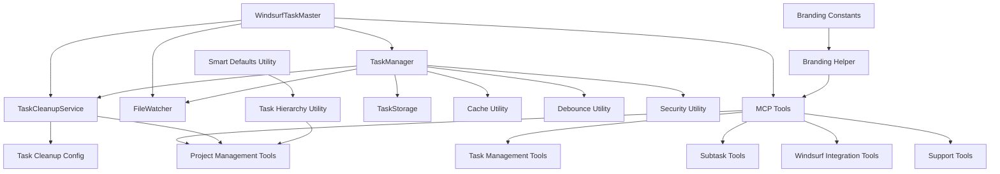
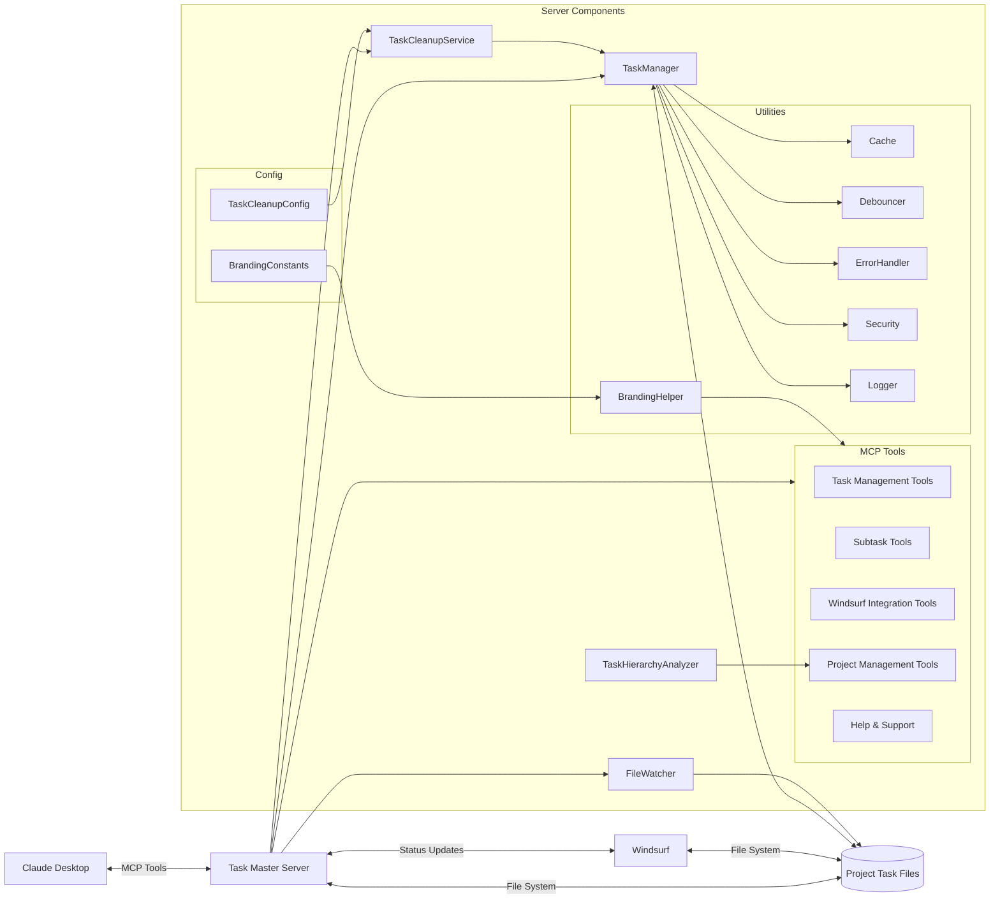
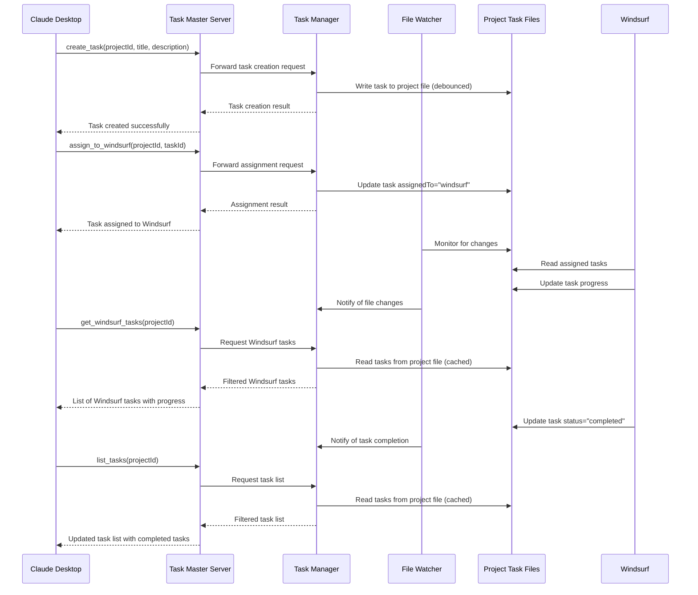
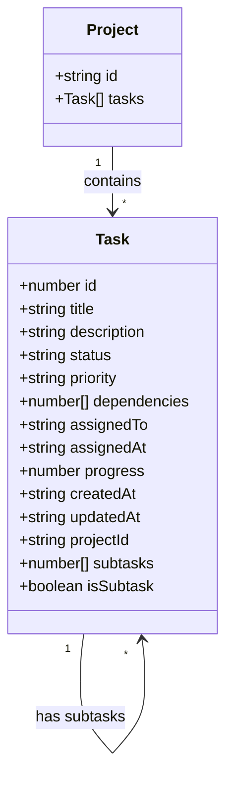
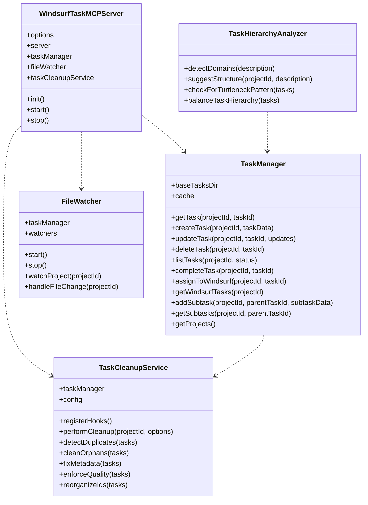

<div align="center">

# Windsurf Task Master™


**Project-aware task management for Windsurf developers**

[](https://github.com/htooayelwinict/windsurf-task-master/blob/main/LICENSE)
[](https://github.com/htooayelwinict/windsurf-task-master/releases)
[](https://github.com/htooayelwinict/windsurf-task-master)

</div>

A powerful MCP server for project-specific task management between Claude Desktop and Windsurf, enabling seamless task creation, progress tracking, and automatic completion without using external APIs.

> **Credits**: This project is inspired by [claude-task-master](https://github.com/eyaltoledano/claude-task-master) by Eyal Toledano and AI Jason. The original concept has been extended with project-specific task isolation and enhanced progress tracking.

## 🚀 Features

### Core Functionality
- **Project Isolation**: Tasks are organized by project, preventing task mixing across different projects
- **Progress Tracking**: Monitor task completion percentages and detailed progress for each project
- **Claude Desktop Integration**: Create and manage tasks directly through Claude Desktop
- **Windsurf Sync**: Automatically sync task updates between Claude Desktop and Windsurf
- **No API Required**: Works entirely through file-based storage and MCP integration

### Task Management
- **Comprehensive Task Operations**: Create, update, list, complete, delete, and track progress of tasks
- **Subtask Support**: Break down complex tasks into manageable subtasks with parent-child relationships
- **Task Hierarchy Analysis**: Intelligent detection and prevention of the "turtleneck pattern" in task hierarchies
- **Smart Project Structure**: Suggests balanced task structures based on project domains

### System Features
- **Branded Experience**: Consistent branding across all components and tools
- **Process Management**: Monitoring and management of Node.js processes with zombie detection
- **Log Rotation**: Automatic log file management to prevent excessive disk usage
- **Real-time Updates**: File watcher detects changes made by Windsurf and displays completion statistics
- **Task Cleanup**: Remove duplicate or unqualified tasks and reorganize task IDs
- **High Performance**: Optimized with caching, debouncing, and indexing strategies
- **Error Resilience**: Robust error handling and logging system

## 🏗️ System Architecture

The Windsurf Task Master™ follows a modular architecture with the following key components:

### Core Components

1. **WindsurfTaskMaster (System)**
   - Core MCP server for project-specific task management
   - Version tracked in package.json
   - Uses FastMCP with stdio transport
   - Manages tasks across projects with isolation
   - Implements consistent branding across all components

2. **TaskManager**
   - Central component for task CRUD operations
   - Manages task state across projects
   - Handles file I/O operations with caching
   - Maintains parent-child relationships for subtasks
   - Provides methods for task filtering and retrieval

3. **FileWatcher**
   - Monitors task files for changes
   - Detects updates made by Windsurf
   - Triggers events for task updates
   - Provides real-time synchronization

4. **TaskCleanupService**
   - Ensures task quality and organization
   - Detects and handles duplicate tasks
   - Manages orphaned subtasks
   - Enforces metadata consistency
   - Reorganizes task IDs for sequential ordering

5. **TaskHierarchyAnalyzer**
   - Analyzes project requirements for balanced task structure
   - Detects and prevents the "turtleneck pattern"
   - Suggests domain-specific task organization
   - Provides smart defaults for task creation multiple projects
   - Implements file-based storage with real-time monitoring

2. **TaskManager (Core Component)**
   - Central component for task CRUD operations
   - Maintains project isolation
   - Implements debounced file operations
   - Handles task indexing for efficient lookups
   - Manages parent-child task relationships

3. **TaskCleanupService (Service)**
   - Handles task cleanup operations
   - Detects and merges duplicate tasks
   - Ensures metadata consistency
   - Reorganizes task IDs
   - Project-specific configuration support

4. **FileWatcher (Service)**
   - Monitors task files for changes
   - Provides real-time updates
   - Handles file system events
   - Ensures data consistency

5. **TaskTools (MCP Tools)**
   - Collection of MCP tools for task management
   - Includes CRUD operations
   - Handles task assignments
   - Manages project operations
   - Implements cleanup functionality

6. **TaskStorage (Storage)**
   - File-based JSON storage
   - Project-specific task files
   - Maintains data integrity
   - Implements caching for performance
   - Handles concurrent access

### Component Relationships





## Data Flow



## Data Structure

### Project Organization

```
tasks/
├── project1/
│   └── tasks.json
├── project2/
│   └── tasks.json
└── project3/
    └── tasks.json
```

### Task Schema



### Task JSON Example

```json
{
  "id": 1,
  "title": "Implement user authentication",
  "description": "Add JWT-based authentication system",
  "status": "in-progress",
  "priority": "high",
  "dependencies": [2, 3],
  "assignedTo": "windsurf",
  "assignedAt": "2025-05-04T10:00:00Z",
  "progress": 75,
  "createdAt": "2025-05-04T09:00:00Z",
  "updatedAt": "2025-05-04T15:30:00Z",
  "subtasks": [4, 5, 6],
  "isSubtask": false
}
```

#### Subtask JSON Example

```json
{
  "id": 4,
  "title": "Implement JWT token generation",
  "description": "Create utility for generating secure JWT tokens",
  "status": "completed",
  "priority": "high",
  "dependencies": [],
  "assignedTo": "windsurf",
  "assignedAt": "2025-05-04T10:30:00Z",
  "progress": 100,
  "createdAt": "2025-05-04T10:15:00Z",
  "updatedAt": "2025-05-04T14:00:00Z",
  "subtasks": [],
  "isSubtask": true
}
```

## Core Components



## MCP Tools

The Windsurf Task Master exposes the following MCP tools for Claude Desktop:

### Task Management

* `create_task`: Create a new task for a project
* `update_task`: Update an existing task
* `complete_task`: Mark a task as completed
* `list_tasks`: List all tasks for a project
* `delete_task`: Delete a task by ID
* `delete_tasks`: Delete multiple tasks based on criteria

### Subtask Management

* `add_subtask`: Add a subtask to a parent task
* `get_subtasks`: Get all subtasks for a parent task

### Windsurf Integration

* `assign_to_windsurf`: Assign a task to Windsurf for processing
* `update_windsurf_progress`: Update progress on a task assigned to Windsurf
* `get_windsurf_tasks`: Get all tasks assigned to Windsurf

### Project Management

* `get_projects`: List all available projects in the task manager
* `display_task_status`: Display detailed status of tasks with completion percentages
* `cleanup_tasks`: Clean up tasks in a project (detect duplicates, fix metadata, reorganize IDs)
* `suggest_project_structure`: Analyze project requirements and suggest balanced task structure

### Help & Support

* `get_help`: Get contextual help and workflow guidance for efficient task management

## Task Cleanup Service

The Task Cleanup Service is an intelligent component that automatically maintains task quality and organization:

1. **Duplicate Detection**:
   - Identifies tasks with similar titles and descriptions
   - Uses semantic similarity to detect near-duplicates
   - Provides options for merging or removing duplicates
   - Prevents task fragmentation and confusion

2. **Metadata Consistency**:
   - Ensures consistent metadata across related tasks
   - Propagates status changes to subtasks
   - Maintains proper parent-child relationships
   - Fixes inconsistent priority levels

3. **Task Quality Enforcement**:
   - Ensures tasks have proper titles and descriptions
   - Validates task properties against schema
   - Enforces minimum quality standards for task titles and descriptions

4. **Configurable Rules**:
   - Project-specific configuration options
   - Customizable thresholds and actions

## Installation

```bash
# Clone the repository
git clone https://github.com/htooayelwinict/windsurf-task-master.git

# Navigate to the project directory
cd windsurf-task-master

# Install dependencies
npm install

# Start the server
npm start
```

## Usage

### Basic Usage

```bash
# Start the MCP server
npm start

# Run with specific log level
LOG_LEVEL=debug npm start

# Check branding consistency
npm run brand-check
```

### Task Management Examples

```javascript
// Create a new task
mcp5_create_task({
  projectId: "my-project",
  title: "Implement feature X",
  description: "Create a new feature that does X",
  priority: "high"
});

// List all tasks for a project
mcp5_list_tasks({
  projectId: "my-project"
});

// Suggest balanced project structure
mcp5_suggest_project_structure({
  projectId: "my-project",
  description: "A project that implements feature X and Y",
  autoCreate: true
});
```

## Documentation

- [API Documentation](docs/API.md)
- [Architecture Overview](docs/architecture.md)
- [Task Cleanup Service](docs/task-cleanup-service.md)
- [Security Guidelines](docs/SECURITY.md)

## Contributing

Contributions are welcome! Please see [CONTRIBUTING.md](CONTRIBUTING.md) for guidelines on how to contribute to this project.

## License

MIT License with Trademark Provisions. See the [LICENSE](./LICENSE) file for details.

Windsurf Task Master is a trademark of Htoo Aye Lwin. All rights reserved.

## Credits

This project is based on [claude-task-master](https://github.com/eyaltoledano/claude-task-master) by Eyal Toledano.
Also thanks to AI Jason (https://www.youtube.com/@AIJasonZ) for the original concept. It has been extended with project-specific task isolation and enhanced progress tracking.
