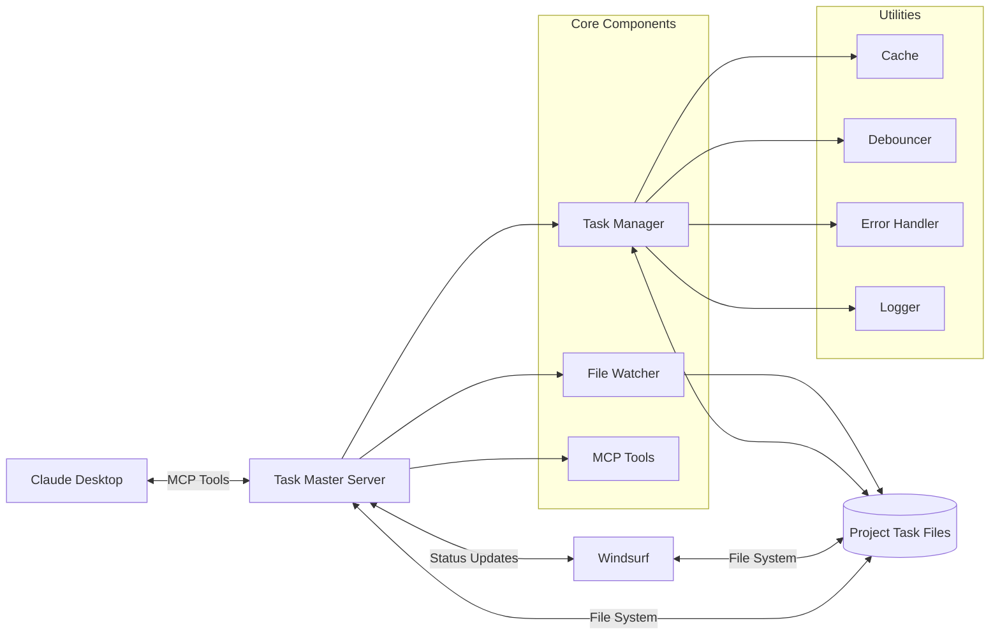
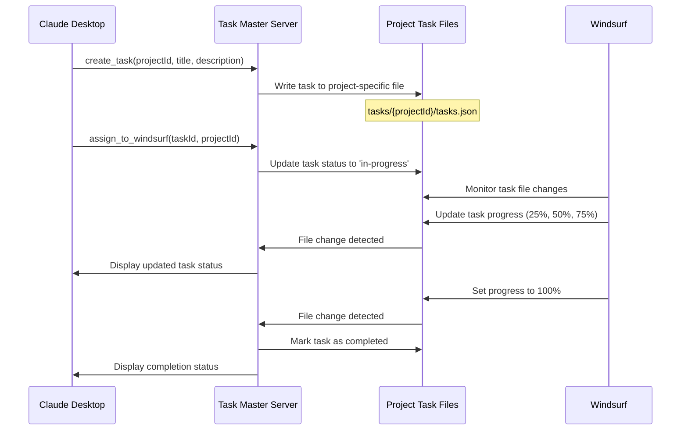
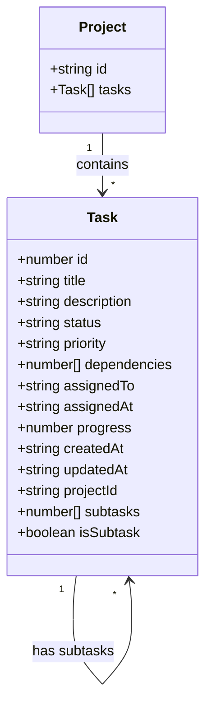
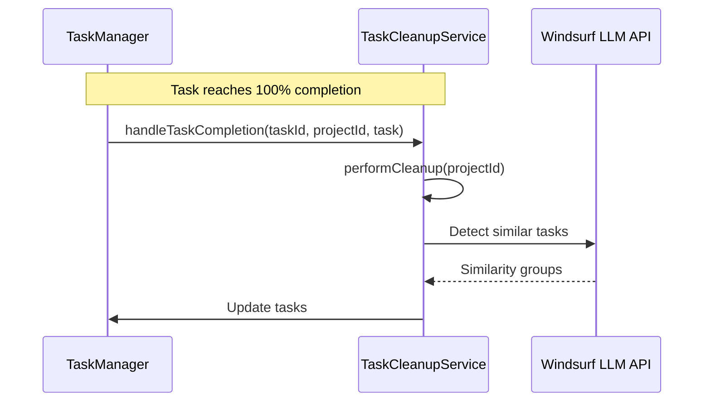
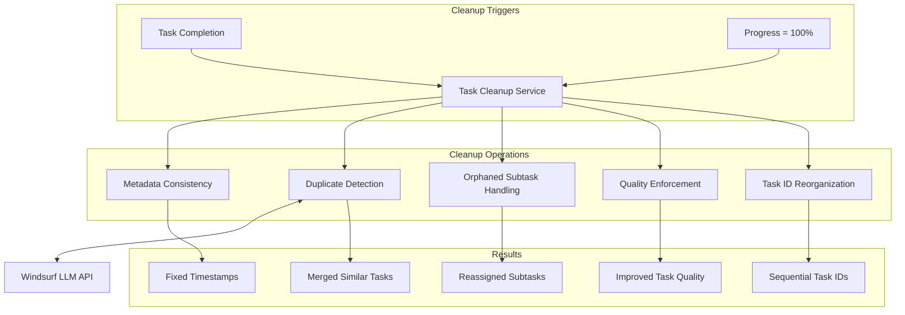

# Windsurf Task Master

A powerful MCP server for project-specific task management between Claude Desktop and Windsurf, enabling seamless task creation, progress tracking, and automatic completion without using external APIs.

> **Credits**: This project is based on [claude-task-master](https://github.com/eyaltoledano/claude-task-master) by Eyal Toledano and AI Jason. The original concept has been extended with project-specific task isolation and enhanced progress tracking.

## Features

- **Project Isolation**: Tasks are organized by project, preventing task mixing across different projects
- **Progress Tracking**: Monitor task completion percentages and detailed progress for each project
- **Claude Desktop Integration**: Create and manage tasks directly through Claude Desktop
- **Windsurf Sync**: Automatically sync task updates between Claude Desktop and Windsurf
- **No API Required**: Works entirely through file-based storage and MCP integration
- **Real-time Updates**: File watcher detects changes made by Windsurf and displays completion statistics
- **Comprehensive Task Management**: Create, update, list, complete, delete, and track progress of tasks
- **Subtask Support**: Break down complex tasks into manageable subtasks with parent-child relationships
- **Task Cleanup**: Remove duplicate or unqualified tasks and reorganize task IDs
- **Automatic Task Maintenance**: Intelligent cleanup service that ensures task quality and organization
- **LLM-Powered Similarity Detection**: Uses Windsurf LLM to identify and merge similar tasks
- **High Performance**: Optimized with caching, debouncing, and indexing strategies
- **Error Resilience**: Robust error handling and logging system

## System Architecture



## Data Flow



## Data Structure

### Project Organization

```
tasks/
├── project1/
│   └── tasks.json
├── project2/
│   └── tasks.json
└── project3/
    └── tasks.json
```

### Task Schema



### Task JSON Example

```json
{
  "id": 1,
  "title": "Implement user authentication",
  "description": "Add JWT-based authentication system",
  "status": "in-progress",
  "priority": "high",
  "dependencies": [2, 3],
  "assignedTo": "windsurf",
  "assignedAt": "2025-05-04T10:00:00Z",
  "progress": 75,
  "createdAt": "2025-05-04T09:00:00Z",
  "updatedAt": "2025-05-04T15:30:00Z",
  "subtasks": [4, 5, 6],
  "isSubtask": false
}
```

#### Subtask JSON Example

```json
{
  "id": 4,
  "title": "Implement JWT token generation",
  "description": "Create utility for generating secure JWT tokens",
  "status": "completed",
  "priority": "high",
  "dependencies": [],
  "assignedTo": "windsurf",
  "assignedAt": "2025-05-04T10:30:00Z",
  "progress": 100,
  "createdAt": "2025-05-04T10:15:00Z",
  "updatedAt": "2025-05-04T14:00:00Z",
  "subtasks": [],
  "isSubtask": true
}
```

## Core Components

### TaskManager

Manages task operations for project-specific task files:

- **init(projectId)**: Initialize task manager for a specific project
- **createTask(taskData, projectId, parentTaskId)**: Create a new task or subtask for a project
- **listTasks(projectId)**: List all tasks for a project
- **updateTask(id, updates, projectId)**: Update a task in a project
- **completeTask(id, projectId)**: Mark a task as completed in a project
- **getTasksByStatus(status, projectId)**: Get tasks filtered by status
- **buildTaskIndices(projectId)**: Build indices for faster task lookups
- **assignToWindsurf(id, projectId)**: Assign a task to Windsurf
- **updateWindsurfTaskProgress(id, progress, projectId)**: Update task progress
- **deleteTask(id, projectId, reorganizeIds)**: Delete a task and its subtasks
- **deleteTasks(criteria, projectId)**: Delete multiple tasks based on criteria
- **reorganizeTaskIds(tasks)**: Reorganize task IDs to maintain sequential ordering
- **addSubtask(subtaskData, parentTaskId, projectId)**: Add a subtask to a parent task
- **getSubtasks(parentTaskId, projectId)**: Get all subtasks for a parent task

### TaskCleanupService

Automatically maintains task quality and organization:



- **Hooks into TaskManager operations**: Triggers cleanup after task completion
- **Metadata Consistency**: Ensures all tasks have proper timestamps and status
- **Duplicate Detection**: Uses Windsurf LLM to identify and merge similar tasks
- **Orphaned Subtask Handling**: Reassigns or converts subtasks with missing parents
- **Task Quality Enforcement**: Flags or fixes tasks with insufficient information
- **Configurable Rules**: Customize cleanup behavior per project

### FileWatcher

Monitors project-specific task files for changes:

- **start()**: Begin watching for file changes in project directories
- **watchTasksFile(projectId, tasksPath)**: Watch a specific project's task file
- **stop()**: Stop watching all files

## Installation

1. Clone this repository:
   ```bash
   git clone https://github.com/yourusername/windsurf-task-master
   cd windsurf-task-master
   ```

2. Install dependencies:
   ```bash
   npm install
   ```

3. Configure Claude Desktop to use this MCP server:
   ```json
   {
     "mcpServers": {
       "windsurf-task-master": {
         "command": "node",
         "args": ["/path/to/windsurf-task-master/mcp-server/server.js"],
         "env": {}
       }
     }
   }
   ```

4. Start the server:
   ```bash
   npm start
   ```

5. Run tests (optional):
   ```bash
   npm test
   ```

## MCP Tools

The following tools are available through the MCP server:

### 1. create_task

Create a new task for a specific project.

```javascript
mcp1_create_task({
  title: "Implement feature X",
  description: "Detailed description of the task",
  priority: "medium", // low, medium, high
  dependencies: [1, 2], // optional
  projectId: "project-name"
})
```

### 2. list_tasks

List all tasks or filter by status for a specific project.

```javascript
mcp1_list_tasks({
  status: "in-progress", // pending, in-progress, completed, all
  projectId: "project-name"
})
```

### 3. update_task

Update an existing task in a specific project.

```javascript
mcp1_update_task({
  id: 1,
  title: "Updated title", // optional
  description: "Updated description", // optional
  status: "in-progress", // optional
  priority: "high", // optional
  dependencies: [3, 4], // optional
  projectId: "project-name"
})
```

### 4. complete_task

Mark a task as completed in a specific project.

```javascript
mcp1_complete_task({
  id: 1,
  projectId: "project-name"
})
```

### 5. assign_to_windsurf

Assign a task to Windsurf for processing.

```javascript
mcp1_assign_to_windsurf({
  id: 1,
  projectId: "project-name"
})
```

### 6. update_windsurf_progress

Update progress on a task assigned to Windsurf.

```javascript
mcp1_update_windsurf_progress({
  id: 1,
  progress: 50, // 0-100
  projectId: "project-name"
})
```

### 7. get_windsurf_tasks

Get all tasks assigned to Windsurf across all projects or from a specific project.

```javascript
mcp1_get_windsurf_tasks({
  projectId: "project-name" // optional
})
```

### 8. display_task_status

Display detailed status of tasks with completion percentages.

```javascript
mcp1_display_task_status({
  projectId: "project-name" // optional
})
```

### 9. delete_task

Delete a task by ID, including all its subtasks.

```javascript
mcp1_delete_task({
  id: 1,
  projectId: "project-name",
  reorganizeIds: true // optional, default: true
})
```

### 10. delete_tasks

Delete multiple tasks based on criteria.

```javascript
mcp1_delete_tasks({
  projectId: "project-name",
  ids: [1, 2, 3], // optional: delete specific task IDs
  status: "completed", // optional: delete all tasks with this status
  duplicates: true, // optional: delete duplicate tasks
  unqualified: true // optional: delete tasks missing required fields
})
```

### 11. add_subtask

Add a subtask to a parent task.

```javascript
mcp1_add_subtask({
  parentTaskId: 1,
  title: "Implement feature Y",
  description: "Detailed description of the subtask",
  priority: "medium", // optional, inherits from parent if not specified
  dependencies: [2, 3], // optional
  projectId: "project-name"
})
```

### 12. get_subtasks

Get all subtasks for a parent task.

```javascript
mcp1_get_subtasks({
  parentTaskId: 1,
  projectId: "project-name"
})
```

## Windsurf Task Management Rules

For efficient task tracking with Windsurf, follow these rules:

### Task Initialization Rules
- Always create tasks with a specific projectId (use lowercase, no spaces)
- Use descriptive titles that clearly indicate the task's purpose
- Break down complex user requests into multiple smaller tasks
- Set initial progress to 0% when assigning to Windsurf
- Create a new project ID for each distinct user objective
- For complex tasks, use subtasks to break them down into manageable pieces

### Progress Tracking Rules
- Update task progress at meaningful milestones (25%, 50%, 75%, 100%)
- Update progress when switching between subtasks of a larger task
- Include specific progress indicators in status updates
- Never leave a task at partial progress when it's actually complete

### Task Completion Rules
- Mark a task as complete only when all requirements are fully satisfied
- Always set progress to 100% when completing a task
- Provide a summary of what was accomplished when completing a task
- Check for and resolve any dependencies before marking a task complete

## Performance Optimizations

### Task Cleanup Service

The Windsurf Task Master includes an intelligent Task Cleanup Service that automatically maintains task quality and organization:



1. **Automatic Cleanup Triggers**:
   - Runs when tasks reach 100% completion
   - Maintains task quality without manual intervention
   - Hooks into TaskManager operations for seamless integration

2. **LLM-Powered Similarity Detection**:
   - Uses Windsurf LLM API to identify semantically similar tasks
   - Intelligently merges duplicate tasks while preserving subtasks
   - Falls back to text-based similarity when LLM is unavailable
   - Configurable similarity thresholds per project

3. **Task Quality Maintenance**:
   - Ensures metadata consistency (timestamps, progress values)
   - Handles orphaned subtasks by reassigning or converting them
   - Enforces minimum quality standards for task titles and descriptions

4. **Configurable Rules**:
   - Project-specific configuration options
   - Customizable thresholds and actions
   - Detailed logging of all cleanup operations
   - Multiple action strategies (fix, flag, delete)

For detailed documentation, see [Task Cleanup Service Documentation](./docs/task-cleanup-service.md)

### Caching Strategy

The Windsurf Task Master implements an in-memory caching system to reduce file system operations and improve performance. Task data is cached with configurable TTL (time-to-live) to ensure data freshness while minimizing I/O operations.

- **TTL-based Expiration**: Cache entries expire after a configurable time period
- **Size Limits**: Cache size is limited to prevent excessive memory usage

### Debouncing

File write operations are optimized using debouncing:

- **Grouped Writes**: Multiple write requests are grouped into a single operation
- **Delayed Execution**: Writes are performed after a configurable delay
- **Promise Queuing**: All pending requests receive the same result

### Task Indexing

Tasks are indexed for faster lookups and filtering:

- **ID-based Index**: O(1) lookup by task ID
- **Status Index**: Fast filtering by task status
- **Assignee Index**: Quick retrieval of tasks by assignee
- **Parent Task Index**: Fast retrieval of subtasks by parent task ID

## Documentation

For detailed API documentation, see [API.md](docs/API.md).

## Contributing

Feel free to submit issues and pull requests to improve the functionality.

## License

MIT

## Credits

This project is based on [claude-task-master](https://github.com/eyaltoledano/claude-task-master) by Eyal Toledano.
Also thanks to AI Jason https://www.youtube.com/@AIJasonZ for the original concept. It has been extended with project-specific task isolation and enhanced progress tracking.

