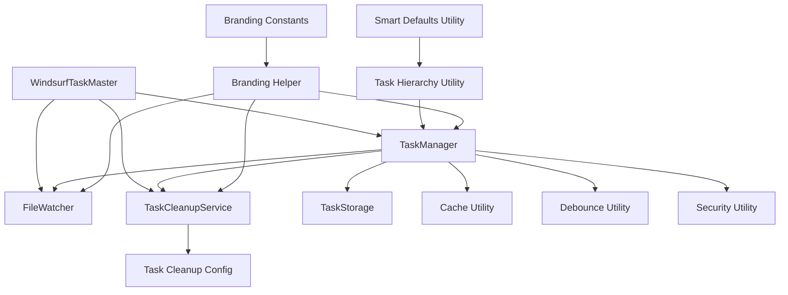
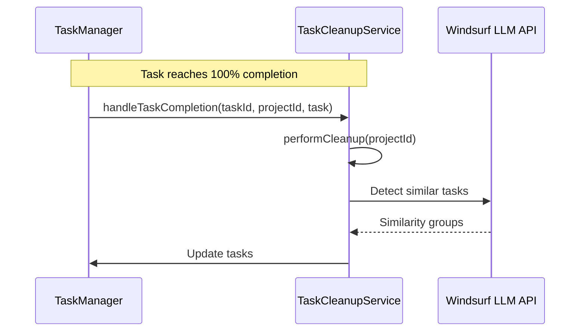
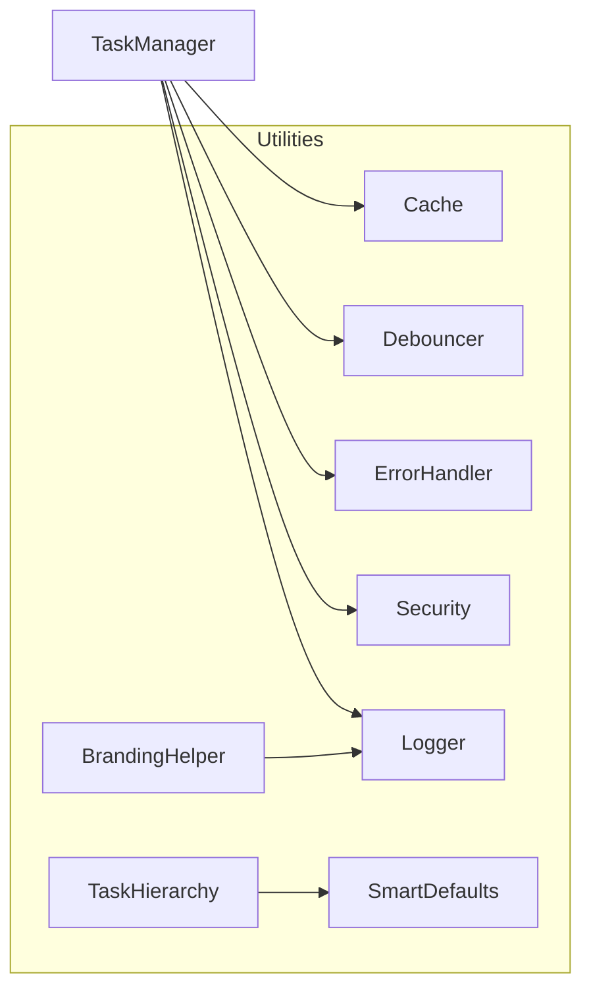
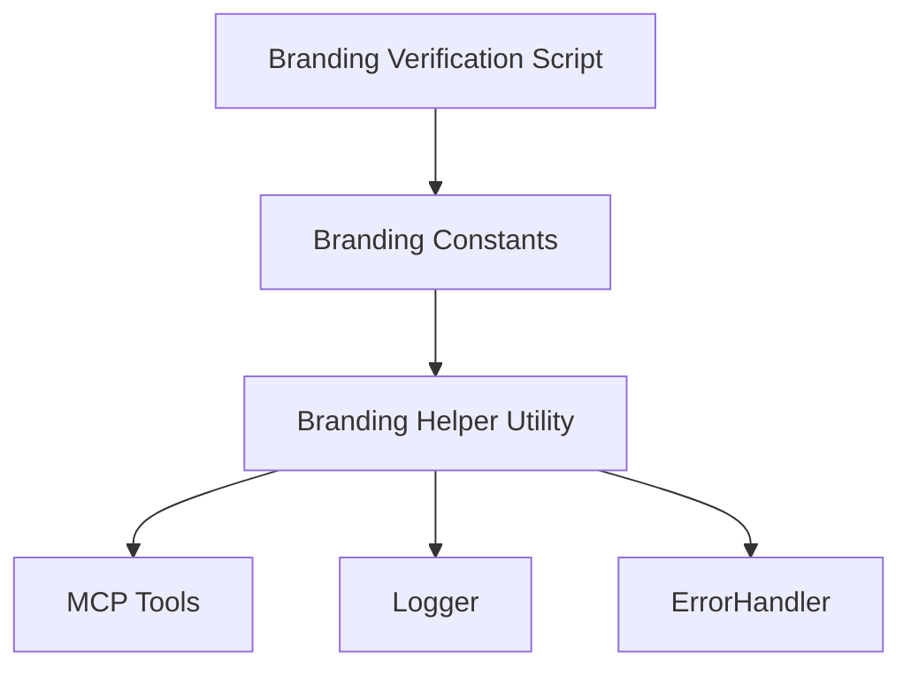
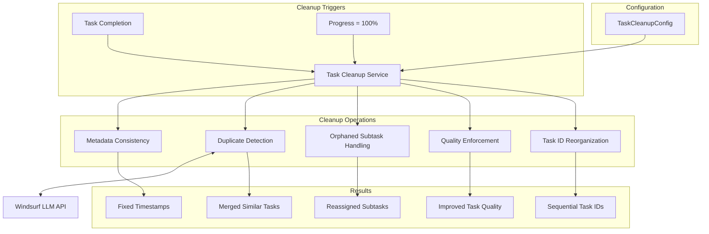

# Windsurf Task Master API Documentation

This document provides detailed information about the core components and utilities of the Windsurf Task Master system.

## Table of Contents

1. [Core Components](#core-components)
   - [TaskManager](#taskmanager)
   - [TaskCleanupService](#taskcleanupservice)
   - [FileWatcher](#filewatcher)
2. [Utilities](#utilities)
   - [Cache](#cache)
   - [Debouncer](#debouncer)
   - [Error Handling](#error-handling)
   - [Logger](#logger)
3. [Task Management](#task-management)
   - [Task Deletion](#task-deletion)
   - [Subtask Management](#subtask-management)
   - [Task Cleanup](#task-cleanup)
4. [Performance Optimization](#performance-optimization)
   - [Caching Strategy](#caching-strategy)
   - [Debouncing Strategy](#debouncing-strategy)
   - [Task Indexing](#task-indexing)

## Core Components

### Component Relationships



### TaskManager

The `TaskManager` class is responsible for managing tasks across different projects. It provides methods for creating, updating, and retrieving tasks.

#### Key Methods

| Method | Description | Parameters | Returns |
|--------|-------------|------------|--------|
| `init(projectId)` | Initialize the task manager for a specific project | `projectId` (string): Project identifier | Promise<void> |
| `createTask(taskData, projectId, parentTaskId)` | Create a new task or subtask for a project | `taskData` (object): Task data, `projectId` (string): Project identifier, `parentTaskId` (number, optional): Parent task ID for subtasks | Promise<Task> |
| `updateTask(id, updates, projectId)` | Update an existing task | `id` (number): Task ID, `updates` (object): Updates to apply, `projectId` (string): Project identifier | Promise<Task> |
| `completeTask(id, projectId)` | Mark a task as completed | `id` (number): Task ID, `projectId` (string): Project identifier | Promise<Task> |
| `listTasks(projectId)` | List all tasks for a project | `projectId` (string): Project identifier | Promise<Task[]> |
| `getTasksByStatus(status, projectId)` | Get tasks filtered by status | `status` (string): Task status, `projectId` (string): Project identifier | Promise<Task[]> |
| `assignToWindsurf(id, projectId)` | Assign a task to Windsurf | `id` (number): Task ID, `projectId` (string): Project identifier | Promise<Task> |
| `getWindsurfTasks(projectId)` | Get tasks assigned to Windsurf | `projectId` (string, optional): Project identifier | Promise<Task[]> |
| `updateWindsurfTaskProgress(id, progress, projectId)` | Update task progress | `id` (number): Task ID, `progress` (number): Progress percentage, `projectId` (string): Project identifier | Promise<Task> |
| `deleteTask(id, projectId, reorganizeIds)` | Delete a task and its subtasks | `id` (number): Task ID, `projectId` (string): Project identifier, `reorganizeIds` (boolean, optional): Whether to reorganize task IDs after deletion | Promise<Task> |
| `deleteTasks(criteria, projectId)` | Delete multiple tasks based on criteria | `criteria` (object): Criteria for selecting tasks to delete, `projectId` (string): Project identifier | Promise<Task[]> |
| `addSubtask(subtaskData, parentTaskId, projectId)` | Add a subtask to a parent task | `subtaskData` (object): Subtask data, `parentTaskId` (number): Parent task ID, `projectId` (string): Project identifier | Promise<Task> |
| `getSubtasks(parentTaskId, projectId)` | Get all subtasks for a parent task | `parentTaskId` (number): Parent task ID, `projectId` (string): Project identifier | Promise<Task[]> |

#### Usage Example

```javascript
import { TaskManager } from '../core/task-manager.js';

// Create a task manager instance
const taskManager = new TaskManager();

// Initialize for a specific project
await taskManager.init('my-project');

// Create a new task
const task = await taskManager.createTask({
  title: 'Implement feature X',
  description: 'Add new functionality',
  priority: 'high'
}, 'my-project');

// Create a subtask
const subtask = await taskManager.addSubtask({
  title: 'Implement helper function',
  description: 'Create utility function for feature X',
  priority: 'medium'
}, task.id, 'my-project');

// Assign to Windsurf
await taskManager.assignToWindsurf(task.id, 'my-project');

// Update progress
await taskManager.updateWindsurfTaskProgress(task.id, 50, 'my-project');

// Complete the task
await taskManager.completeTask(task.id, 'my-project');

// Delete a task and its subtasks
await taskManager.deleteTask(task.id, 'my-project', true);

// Delete multiple tasks based on criteria
await taskManager.deleteTasks({
  status: 'completed'
}, 'my-project');
```

### TaskCleanupService

The `TaskCleanupService` class automatically maintains task quality and organization by performing cleanup operations after task completion.



#### Key Methods

| Method | Description | Parameters | Returns |
|--------|-------------|------------|--------|
| `constructor(taskManager)` | Initialize the Task Cleanup Service | `taskManager` (TaskManager): Instance of TaskManager | TaskCleanupService |
| `registerHooks()` | Register hooks with the TaskManager | None | void |
| `handleTaskCompletion(taskId, projectId, taskData)` | Handle task completion event | `taskId` (number): Task ID, `projectId` (string): Project ID, `taskData` (object): Task data | Promise<void> |
| `performCleanup(projectId)` | Perform cleanup operations on a project | `projectId` (string): Project ID | Promise<Array> |
| `ensureMetadataConsistency(tasks, projectId, config)` | Ensure metadata consistency across tasks | `tasks` (Array): List of tasks, `projectId` (string): Project ID, `config` (object): Cleanup configuration | Promise<Array> |
| `handleOrphanedSubtasks(tasks, projectId, config)` | Handle orphaned subtasks | `tasks` (Array): List of tasks, `projectId` (string): Project ID, `config` (object): Cleanup configuration | Promise<Array> |
| `enforceTaskQuality(tasks, projectId, config)` | Enforce task quality standards | `tasks` (Array): List of tasks, `projectId` (string): Project ID, `config` (object): Cleanup configuration | Promise<Array> |
| `detectAndHandleDuplicates(tasks, projectId, config)` | Detect and handle duplicate tasks | `tasks` (Array): List of tasks, `projectId` (string): Project ID, `config` (object): Cleanup configuration | Promise<Array> |
| `reorganizeTaskIds(projectId, config)` | Reorganize task IDs to maintain sequential ordering | `projectId` (string): Project ID, `config` (object): Cleanup configuration | Promise<Array> |

#### Usage Example

```javascript
import { TaskManager } from '../core/task-manager.js';
import TaskCleanupService from '../core/task-cleanup-service.js';

// Create a task manager instance
const taskManager = new TaskManager();

// Initialize the task cleanup service
const cleanupService = new TaskCleanupService(taskManager);

// Register hooks
cleanupService.registerHooks();

// Manually trigger cleanup for a project
await cleanupService.performCleanup('my-project');
```

### FileWatcher

The `FileWatcher` class monitors task files for changes and triggers appropriate actions when changes are detected.

## Utilities



### Cache

The `Cache` utility provides in-memory caching functionality to improve performance by reducing file system operations.

#### Key Methods

| Method | Description | Parameters | Returns |
|--------|-------------|------------|---------|
| `get(key)` | Get a value from cache | `key` (string): Cache key | Value or undefined |
| `set(key, value, ttl)` | Set a value in cache | `key` (string): Cache key, `value` (any): Value to cache, `ttl` (number, optional): Time-to-live in ms | void |
| `delete(key)` | Delete a value from cache | `key` (string): Cache key | void |
| `clear()` | Clear all cached data | None | void |
| `getStats()` | Get cache statistics | None | Object with stats |

#### Usage Example

```javascript
import { Cache } from '../utils/cache.js';

// Create a cache instance
const cache = new Cache({
  ttl: 5000,      // 5 seconds TTL
  maxSize: 100    // Maximum 100 items
});

// Set a value
cache.set('user-123', { name: 'John', role: 'admin' });

// Get a value
const user = cache.get('user-123');

// Get cache statistics
const stats = cache.getStats();
console.log(`Cache hit rate: ${stats.hitRate}%`);
```

### Debouncer

The `Debouncer` utility optimizes operations by delaying execution until a specified time has passed since the last call.

#### Key Methods

| Method | Description | Parameters | Returns |
|--------|-------------|------------|---------|
| `debounce(key, operation, delay, context)` | Debounce an async operation | `key` (string): Operation identifier, `operation` (function): Async function, `delay` (number): Delay in ms, `context` (any, optional): Operation context | Promise<any> |
| `cancel(key)` | Cancel a debounced operation | `key` (string): Operation identifier | void |
| `cancelAll()` | Cancel all debounced operations | None | void |

#### Usage Example

```javascript
import { Debouncer } from '../utils/debounce.js';

// Create a debouncer instance
const debouncer = new Debouncer();

// Debounce a file write operation
await debouncer.debounce(
  'save-user-123',
  async () => {
    await fs.writeFile('user-123.json', JSON.stringify(userData));
    return 'File saved';
  },
  1000  // 1 second delay
);

// Cancel a specific debounced operation
debouncer.cancel('save-user-123');
```

### Error Handling

The error handling system provides custom error classes and logging functionality.

#### Custom Error Classes

| Error Class | Description | Properties |
|-------------|-------------|------------|
| `TaskMasterError` | Base error class | `code`, `details` |
| `TaskNotFoundError` | Error for when a task is not found | `taskId`, `projectId` |
| `ProjectNotFoundError` | Error for when a project is not found | `projectId` |
| `FileSystemError` | Error for file system operations | `operation`, `path` |
| `TaskStateError` | Error for invalid task state transitions | `taskId`, `currentState`, `action` |

#### Usage Example

```javascript
import { TaskNotFoundError } from '../utils/errors.js';

// Throw a custom error
throw new TaskNotFoundError(123, 'my-project');

// Catch and handle a custom error
try {
  await taskManager.getTask(123, 'my-project');
} catch (error) {
  if (error instanceof TaskNotFoundError) {
    console.error(`Task not found: ${error.taskId}`);
  } else {
    console.error('Unknown error:', error);
  }
}
```

### Logger

The `Logger` utility provides structured logging functionality with different log levels.

#### Key Methods

| Method | Description | Parameters |
|--------|-------------|------------|
| `info(message, metadata)` | Log an informational message | `message` (string): Log message, `metadata` (object, optional): Additional data |
| `error(message, metadata)` | Log an error message | `message` (string): Error message, `metadata` (object, optional): Additional data |

#### Usage Example

```javascript
import { logger } from '../utils/logger.js';

// Log an informational message
logger.info('User logged in', { userId: 123, timestamp: new Date() });

// Log an error
logger.error('Failed to process payment', { 
  userId: 123, 
  error: new Error('Payment gateway error') 
});
```

## MCP Tools

The Windsurf Task Master exposes a comprehensive set of MCP tools for task management. These tools are categorized into five main groups:

```mermaid
flowchart TD
    MCPTools[MCP Tools] --> TMT[Task Management Tools]
    MCPTools --> ST[Subtask Tools]
    MCPTools --> WIT[Windsurf Integration Tools]
    MCPTools --> PMT[Project Management Tools]
    MCPTools --> SPT[Support Tools]
    
    %% Task Management Tools
    TMT --> create_task
    TMT --> update_task
    TMT --> complete_task
    TMT --> delete_task
    TMT --> delete_tasks
    TMT --> list_tasks
    
    %% Subtask Tools
    ST --> add_subtask
    ST --> get_subtasks
    
    %% Windsurf Integration Tools
    WIT --> assign_to_windsurf
    WIT --> get_windsurf_tasks
    WIT --> update_windsurf_progress
    
    %% Project Management Tools
    PMT --> get_projects
    PMT --> cleanup_tasks
    PMT --> suggest_project_structure
    
    %% Support Tools
    SPT --> get_help
    SPT --> display_task_status
```



### Tool Categories

#### Task Management Tools

- **create_task**: Create a new task for a project
- **update_task**: Update an existing task's properties
- **complete_task**: Mark a task as completed
- **delete_task**: Delete a task and its subtasks
- **delete_tasks**: Delete multiple tasks based on criteria
- **list_tasks**: List all tasks or filter by status

#### Subtask Tools

- **add_subtask**: Add a subtask to a parent task
- **get_subtasks**: Get all subtasks for a parent task

#### Windsurf Integration Tools

- **assign_to_windsurf**: Assign a task to Windsurf for processing
- **get_windsurf_tasks**: Get all tasks assigned to Windsurf
- **update_windsurf_progress**: Update progress on a task assigned to Windsurf

#### Project Management Tools

- **get_projects**: Get all available projects
- **cleanup_tasks**: Clean up tasks in a project
- **suggest_project_structure**: Analyze project requirements and suggest balanced task structure

#### Support Tools

- **get_help**: Get contextual help and workflow guidance
- **display_task_status**: Display detailed status of tasks with completion percentages

## Branding

The Windsurf Task Master incorporates consistent branding across all components and tools.



### Branding Constants

The branding constants define the core identity elements of the Windsurf Task Master:

- **Product Name**: The official name of the product
- **Tagline**: A short descriptive phrase
- **Copyright**: Copyright information
- **CLI Banner**: ASCII art banner for CLI display
- **Colors**: Brand colors for console output
- **URLs**: Important URLs (documentation, support, etc.)

### Branding Helper Utility

The Branding Helper provides methods for consistent branding across the application:

| Method | Description | Parameters |
|--------|-------------|------------|
| `formatBrandedMessage(message)` | Format a message with branding | `message` (string): Message to format |
| `getVersionString()` | Get formatted version string | None |
| `getBrandedBanner()` | Get CLI banner with branding | None |
| `formatErrorMessage(error)` | Format error message with branding | `error` (Error): Error to format |

### Branding Verification

The system includes a verification script that ensures branding consistency across all components:

- Validates branding constants against package.json
- Checks for consistent branding in all tools and components
- Verifies correct usage of branding helper methods

## Performance Optimization

### Caching Strategy

The Windsurf Task Master implements a caching strategy to reduce file system operations:

1. **Task Data Caching**: Task data is cached in memory to avoid repeated file reads
2. **TTL-based Expiration**: Cached data expires after a configurable time-to-live period
3. **Automatic Eviction**: Least recently used items are evicted when the cache reaches its size limit

### Debouncing Strategy

File write operations are debounced to optimize performance:

1. **Grouped Writes**: Multiple write requests within a short time window are grouped into a single operation
2. **Delayed Execution**: Write operations are delayed until a specified time has passed since the last request
3. **Promise Queuing**: All requests within the debounce window receive the same result promise

## Task Management

### Task Cleanup

The Windsurf Task Master provides an intelligent Task Cleanup Service that automatically maintains task quality and organization:



#### Cleanup Operations

1. **Metadata Consistency**

   Ensures that task metadata is consistent and accurate:
   - Adds missing `completedAt` timestamps to completed tasks
   - Ensures progress values match task status (e.g., 100% for completed tasks)
   - Adds missing `assignedAt` timestamps to assigned tasks

2. **Duplicate Detection**

   Identifies and handles similar tasks:
   - Uses Windsurf LLM API for semantic similarity detection
   - Falls back to text-based similarity when LLM is unavailable
   - Keeps the oldest task and deletes duplicates
   - Transfers subtasks from duplicates to the kept task

3. **Orphaned Subtask Handling**

   Manages subtasks that have lost their parent tasks:
   - Identifies subtasks with no valid parent reference
   - Can delete, convert to regular tasks, or reassign to another parent
   - Configurable action per project

4. **Task Quality Enforcement**

   Ensures tasks meet minimum quality standards:
   - Validates minimum title and description lengths
   - Checks for required fields like priority
   - Can flag, fix, or delete low-quality tasks

5. **Task ID Reorganization**

   Maintains sequential task IDs after deletions:
   - Renumbers tasks to maintain sequential ordering
   - Updates references in dependencies and subtasks
   - Can be triggered automatically after deletions

#### Configuration

The Task Cleanup Service is highly configurable through the `task-cleanup-config.js` file:

```javascript
// Example configuration
export const taskCleanupConfig = {
  enabled: true,
  triggers: {
    onTaskCompletion: true,
    onTaskCompletionThreshold: 100
  },
  operations: {
    detectDuplicates: {
      enabled: true,
      useLLM: true,
      similarityThreshold: 0.85
    },
    metadataConsistency: {
      enabled: true
    },
    orphanedSubtasks: {
      enabled: true,
      action: 'reassign'
    },
    qualityEnforcement: {
      enabled: true,
      minTitleLength: 5,
      minDescriptionLength: 10,
      action: 'flag'
    },
    reorganizeTaskIds: {
      enabled: true
    }
  }
};
```

For detailed documentation, see [Task Cleanup Service Documentation](./task-cleanup-service.md).

### Task Deletion

The Windsurf Task Master provides robust task deletion capabilities:

#### Single Task Deletion

The `deleteTask` method allows deleting a single task by ID:

```javascript
await taskManager.deleteTask(taskId, projectId, reorganizeIds);
```

This method:
- Deletes the specified task
- Automatically deletes all subtasks
- Optionally reorganizes task IDs to maintain sequential ordering
- Updates parent-child relationships for subtasks

#### Batch Task Deletion

The `deleteTasks` method allows deleting multiple tasks based on various criteria:

```javascript
await taskManager.deleteTasks(criteria, projectId);
```

Supported criteria include:
- **By IDs**: Delete specific tasks by their IDs
- **By Status**: Delete all tasks with a specific status
- **Duplicates**: Remove tasks with identical titles and descriptions
- **Unqualified**: Remove tasks missing required fields

### Subtask Management

The system supports hierarchical task management through subtasks:

#### Adding Subtasks

Subtasks can be added to parent tasks using the `addSubtask` method:

```javascript
await taskManager.addSubtask(subtaskData, parentTaskId, projectId);
```

Subtasks:
- Are regular tasks with a parent-child relationship
- Inherit properties from their parent tasks (e.g., priority)
- Are tracked in a parent-child relationship map
- Are automatically deleted when their parent is deleted

#### Retrieving Subtasks

Subtasks can be retrieved using the `getSubtasks` method:

```javascript
const subtasks = await taskManager.getSubtasks(parentTaskId, projectId);
```

This returns all subtasks associated with a specific parent task.

### Task Indexing

Tasks are indexed for faster lookups:

1. **ID-based Index**: Tasks are indexed by their ID for O(1) lookup
2. **Status Index**: Tasks are indexed by status for efficient filtering
3. **Assignee Index**: Tasks are indexed by assignee for quick retrieval of tasks assigned to specific users
4. **Parent Task Index**: Tasks are indexed by parent task ID for efficient subtask retrieval
