# Task Cleanup Service Documentation

The Task Cleanup Service is an intelligent component of the Windsurf Task Master that automatically maintains task quality and organization. This document provides comprehensive information about the service, including its architecture, configuration options, and integration with the task management system.

## Table of Contents

1. [Overview](#overview)
2. [Architecture](#architecture)
3. [Cleanup Operations](#cleanup-operations)
4. [Configuration](#configuration)
5. [LLM Integration](#llm-integration)
6. [Usage Examples](#usage-examples)
7. [API Reference](#api-reference)

## Overview

The Task Cleanup Service addresses common issues in task management systems:

- Duplicate or similar tasks that cause confusion
- Inconsistent metadata across tasks
- Orphaned subtasks when parent tasks are deleted
- Low-quality task descriptions that lack sufficient detail
- Non-sequential task IDs after deletions

By automatically handling these issues, the service ensures that the task management system remains clean, organized, and efficient over time.

## Architecture

The Task Cleanup Service uses a hook-based architecture to integrate with the TaskManager and trigger cleanup operations at appropriate times.

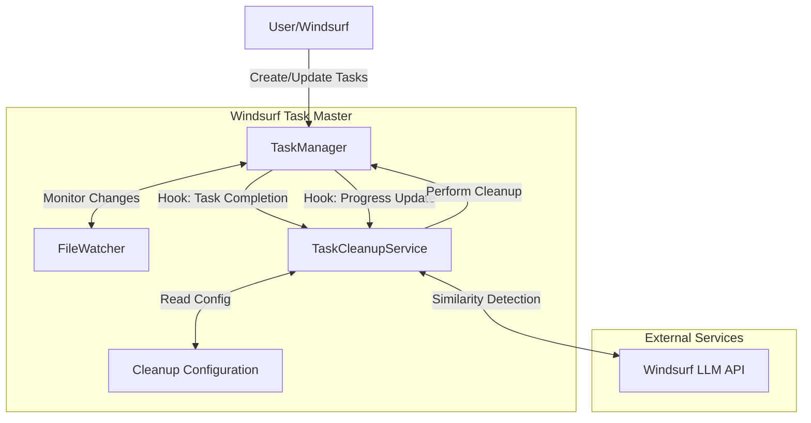

### Initialization and Hook Registration

The service registers hooks with the TaskManager during initialization:

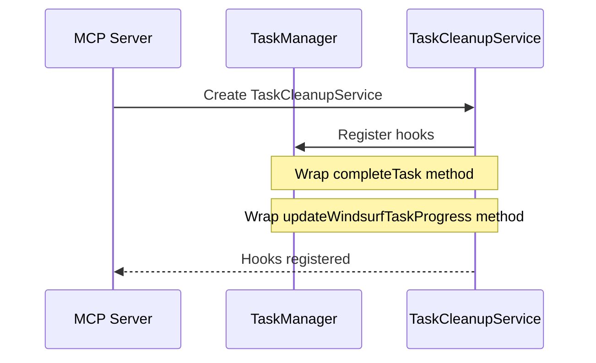

### Cleanup Trigger Flow

The service is triggered when a task reaches 100% completion:

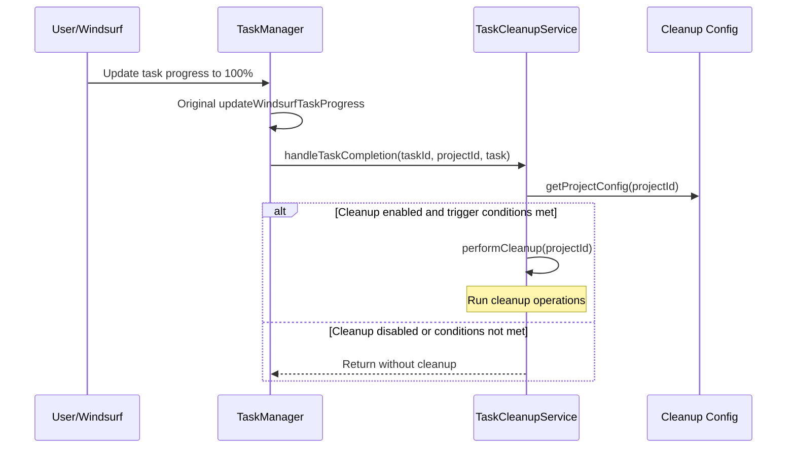

## Cleanup Operations

The Task Cleanup Service performs several types of cleanup operations:

### Metadata Consistency

Ensures that task metadata is consistent and accurate:

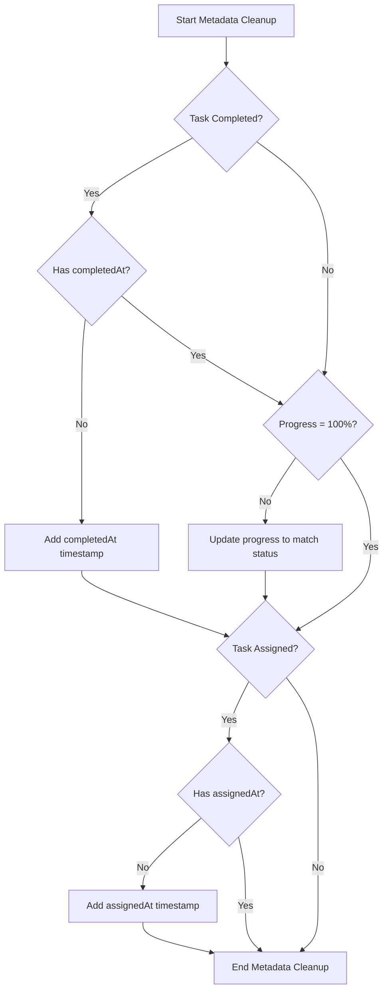

### Duplicate Detection

Identifies and handles similar tasks using LLM or text-based similarity:

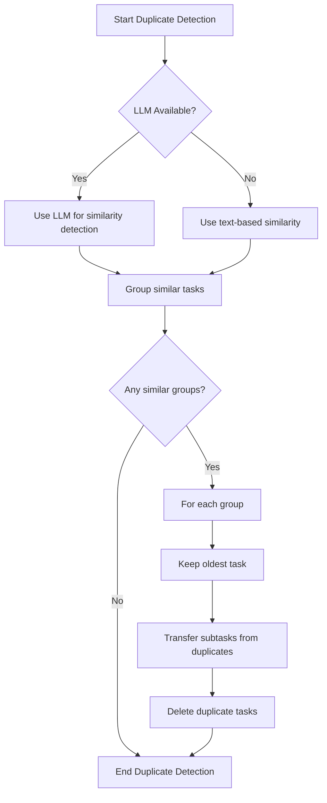

### Orphaned Subtask Handling

Manages subtasks that have lost their parent tasks:

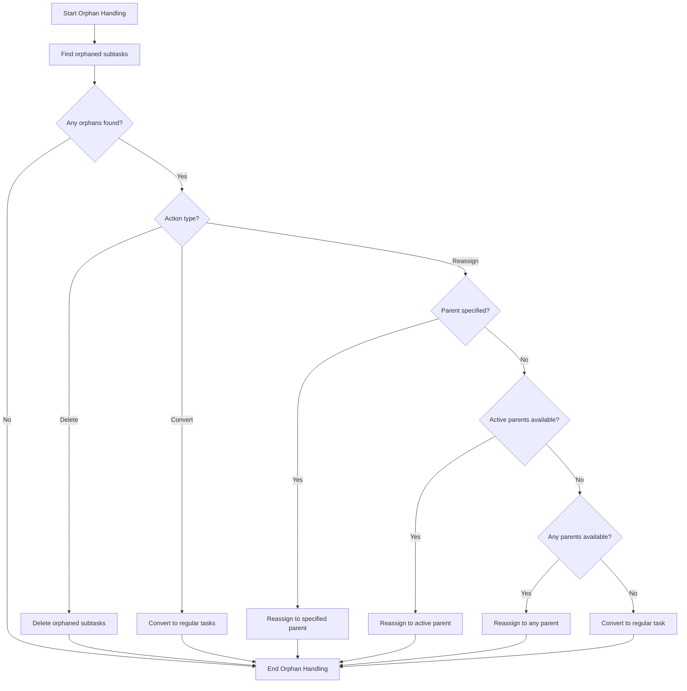

### Task Quality Enforcement

Ensures tasks meet minimum quality standards:

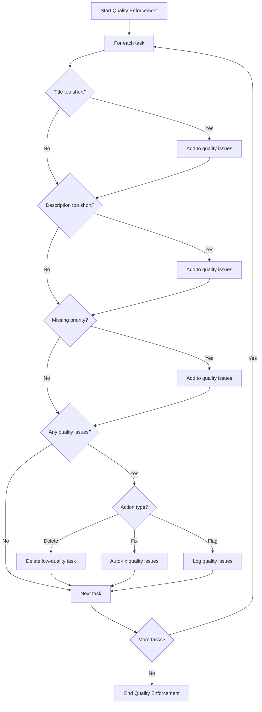

### Task ID Reorganization

Maintains sequential task IDs after deletions:

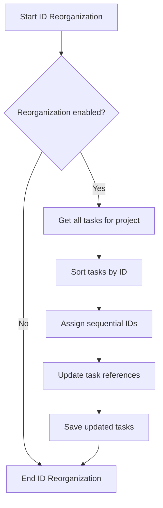

## Configuration

The Task Cleanup Service is highly configurable through the `task-cleanup-config.js` file. The configuration is structured as follows:

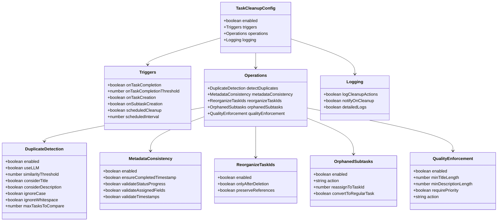

### Project-Specific Configuration

The service supports project-specific configurations that override the global settings:

```javascript
// Example of project-specific configuration
export const projectSpecificConfigs = {
  'documentation-update': {
    operations: {
      detectDuplicates: {
        similarityThreshold: 0.75   // Lower threshold for documentation projects
      }
    }
  }
};
```

## LLM Integration

The Task Cleanup Service integrates with the Windsurf LLM API for intelligent similarity detection:

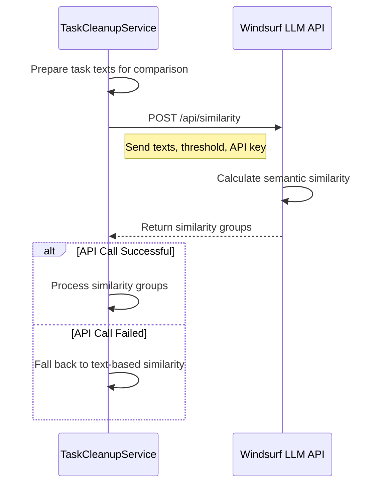

### Fallback Mechanism

If the LLM API is unavailable, the service falls back to text-based similarity using a Jaccard similarity algorithm:

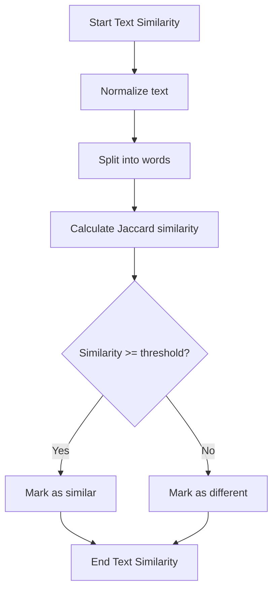

## Usage Examples

### Basic Usage

The Task Cleanup Service is automatically initialized and registered when the MCP server starts:

```javascript
// In mcp-server/src/index.js
import TaskCleanupService from './core/task-cleanup-service.js';

// Initialize the service
this.taskCleanupService = new TaskCleanupService(this.taskManager);

// Register hooks
this.taskCleanupService.registerHooks();
```

### Customizing Cleanup Behavior

To customize the cleanup behavior, modify the configuration in `task-cleanup-config.js`:

```javascript
// Example: Disable duplicate detection but enable metadata consistency
export const taskCleanupConfig = {
  enabled: true,
  operations: {
    detectDuplicates: {
      enabled: false
    },
    metadataConsistency: {
      enabled: true,
      ensureCompletedTimestamp: true,
      validateStatusProgress: true
    }
  }
};
```

### Manual Cleanup Trigger

You can manually trigger cleanup for a specific project:

```javascript
// Get the TaskCleanupService instance
const cleanupService = server.taskCleanupService;

// Manually trigger cleanup for a project
await cleanupService.performCleanup('my-project');
```

## API Reference

### TaskCleanupService Class

The main class that implements the cleanup functionality:

| Method | Description | Parameters | Returns |
|--------|-------------|------------|---------|
| `constructor(taskManager)` | Initialize the Task Cleanup Service | `taskManager` (TaskManager): Instance of TaskManager | TaskCleanupService |
| `registerHooks()` | Register hooks with the TaskManager | None | void |
| `handleTaskCompletion(taskId, projectId, taskData)` | Handle task completion event | `taskId` (number): Task ID, `projectId` (string): Project ID, `taskData` (object): Task data | Promise<void> |
| `performCleanup(projectId)` | Perform cleanup operations on a project | `projectId` (string): Project ID | Promise<Array> |
| `ensureMetadataConsistency(tasks, projectId, config)` | Ensure metadata consistency across tasks | `tasks` (Array): List of tasks, `projectId` (string): Project ID, `config` (object): Cleanup configuration | Promise<Array> |
| `handleOrphanedSubtasks(tasks, projectId, config)` | Handle orphaned subtasks | `tasks` (Array): List of tasks, `projectId` (string): Project ID, `config` (object): Cleanup configuration | Promise<Array> |
| `enforceTaskQuality(tasks, projectId, config)` | Enforce task quality standards | `tasks` (Array): List of tasks, `projectId` (string): Project ID, `config` (object): Cleanup configuration | Promise<Array> |
| `detectAndHandleDuplicates(tasks, projectId, config)` | Detect and handle duplicate tasks | `tasks` (Array): List of tasks, `projectId` (string): Project ID, `config` (object): Cleanup configuration | Promise<Array> |
| `reorganizeTaskIds(projectId, config)` | Reorganize task IDs to maintain sequential ordering | `projectId` (string): Project ID, `config` (object): Cleanup configuration | Promise<Array> |

### Configuration API

Functions for working with the cleanup configuration:

| Function | Description | Parameters | Returns |
|----------|-------------|------------|---------|
| `getProjectConfig(projectId)` | Get configuration for a specific project | `projectId` (string): Project ID | Object |
| `mergeConfigs(target, source)` | Deep merge two configuration objects | `target` (object): Target configuration, `source` (object): Source configuration | Object |
